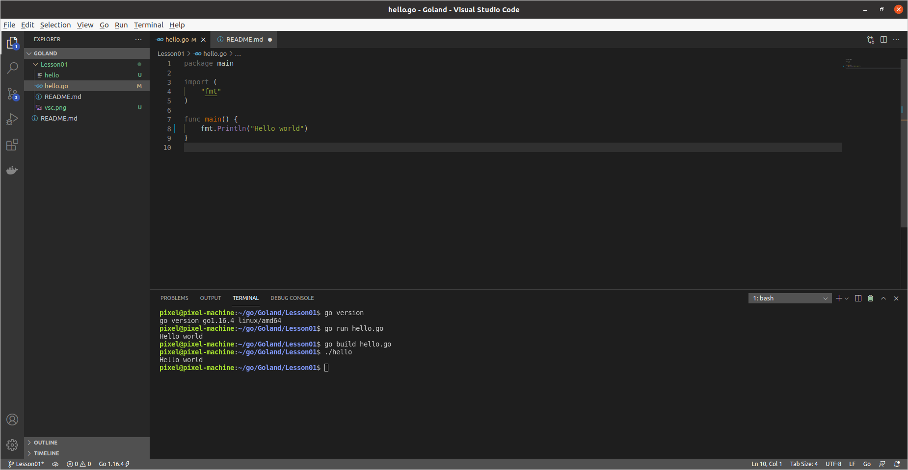

#### GO.Lesson 1

code
```go
package main

import (
	"fmt"
)

func main() {
	fmt.Println("Hello world")
}
```

terminal
```
pixel@pixel-machine:~/go/Goland/Lesson01$ go version
go version go1.16.4 linux/amd64
pixel@pixel-machine:~/go/Goland/Lesson01$ go run hello.go
Hello world
pixel@pixel-machine:~/go/Goland/Lesson01$ go build hello.go
pixel@pixel-machine:~/go/Goland/Lesson01$ ./hello
Hello world
pixel@pixel-machine:~/go/Goland/Lesson01$
```




