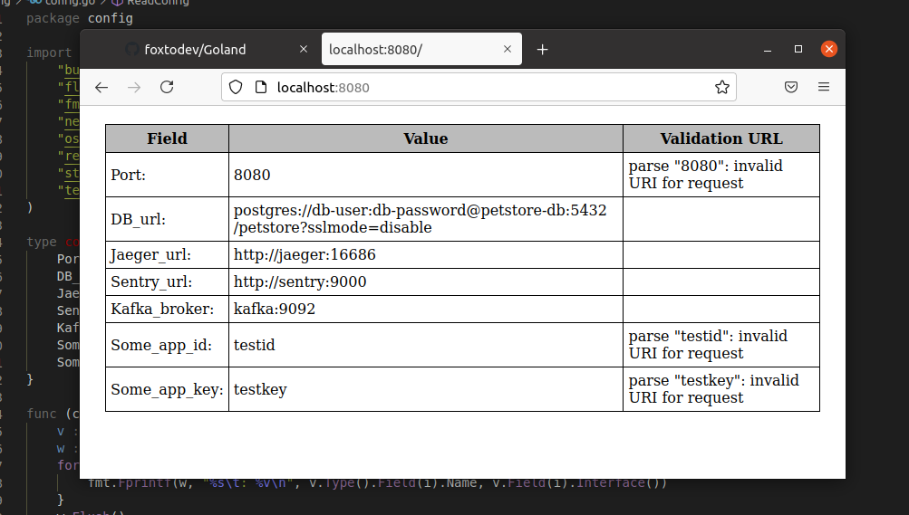

##### Разработайте пакет для чтения конфигурации типичного веб-приложения через флаги или переменные окружения. Пример конфигурации можно посмотреть здесь. По желанию вы можете задать другие имена полям, сгруппировать их или добавить собственные поля.

```go
type conf struct {
	Port         string
	DB_url       string
	Jaeger_url   string
	Sentry_url   string
	Kafka_broker string
	Some_app_id  string
	Some_app_key string
}

func ReadConfig() conf {

	buffer := []string{}

	file, err := os.Open("conf.yaml")
	if err != nil {
		panic(fmt.Sprintf("error opening %s: %v", "conf.yaml", err))
	}
	defer file.Close()

	scanner := bufio.NewScanner(file)
	for scanner.Scan() {
		configLine := strings.Split(string(scanner.Text()), ": ")
		buffer = append(buffer, configLine[1])
	}

	var port = flag.String("port", buffer[0], "port number")
	var db_url = flag.String("db", buffer[1], "db_url")
	var jaeger_url = flag.String("jaeger", buffer[2], "jaeger_url")
	var sentry_url = flag.String("sentry", buffer[3], "sentry_url")
	var kafka_broker = flag.String("kafka", buffer[4], "kafka_broker")
	var some_app_id = flag.String("appid", buffer[5], "some_app_id")
	var some_app_key = flag.String("appkey", buffer[6], "some_app_key")
	flag.Parse()

	config := conf{
		Port:         *port,
		DB_url:       *db_url,
		Jaeger_url:   *jaeger_url,
		Sentry_url:   *sentry_url,
		Kafka_broker: *kafka_broker,
		Some_app_id:  *some_app_id,
		Some_app_key: *some_app_key,
	}

	config.Display()

	return config

}
```


##### Помимо чтения конфигурации приложение также должно валидировать её - например, все URL’ы должны соответствовать ожидаемым форматам.

```go
func IsUrl(str string) error {
	_, err := url.ParseRequestURI(str)
	return err
}

if strings.Contains(configLine[0], "url") {
	err := IsUrl(configLine[1])
	if err != nil {
		panic(err)
	}
}
```

<br />

