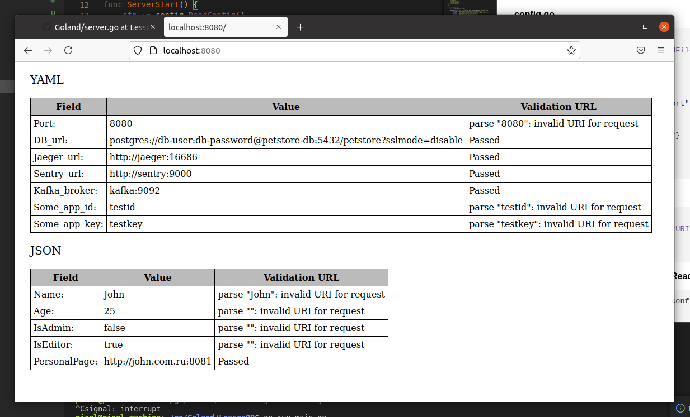

##### config.go

```go
func ReadConfig() conf {
	configPort, err := os.ReadFile("server.cfg")
	if err != nil {
		log.Fatalln(err)
	}

	var port = flag.String("port", string(configPort), "Port number")
	flag.Parse()

	config := conf{Port: *port}

	return config
}
```


##### URL validation

```go
func IsUrl(str string) error {
	_, err := url.ParseRequestURI(str)
	if err == nil {
		err = errors.New("Passed")
	}
	return err
}
```
##### myyaml.go / 2 variants (ReadConfig, ReadConfigYamlToJson)

```go
func ReadConfig(fileName string) conf {
	buffer := []string{}

	file, err := os.Open(fileName)
	if err != nil {
		log.Fatalln(err)
	}
	defer func() {
		err = file.Close()
		if err != nil {
			log.Fatalln(err)
		}
	}()

	scanner := bufio.NewScanner(file)
	for scanner.Scan() {
		configLine := strings.Split(string(scanner.Text()), ": ")
		buffer = append(buffer, configLine[1])
	}

	config := conf{
		Port:         buffer[0],
		DB_url:       buffer[1],
		Jaeger_url:   buffer[2],
		Sentry_url:   buffer[3],
		Kafka_broker: buffer[4],
		Some_app_id:  buffer[5],
		Some_app_key: buffer[6],
	}

	return config
}
```

```go
func ReadConfigYamlToJson(fileName string) conf {
	configData, err := os.ReadFile(fileName)
	if err != nil {
		log.Fatalln(err)
	}

	data := "{\n"
	configLines := strings.Split(string(configData), "\n")
	for _, strLine := range configLines {
		configLine := strings.Split(string(strLine), ": ")
		data += "\t\"" + configLine[0] + "\": \"" + configLine[1] + "\",\n"
	}
	data = data[:len(data)-2] + "\n}"

	config := conf{}
	err = json.Unmarshal([]byte(data), &config)
	if err != nil {
		log.Fatalln(err)
	}

	return config
}
```

##### myjson.go

```go
func ReadConfigJson(fileName string) conf {
	configData, err := os.ReadFile(fileName)
	if err != nil {
		log.Fatalln(err)
	}

	config := conf{}
	err = json.Unmarshal(configData, &config)
	if err != nil {
		log.Fatalln(err)
	}

	return config
}
```


<br />
